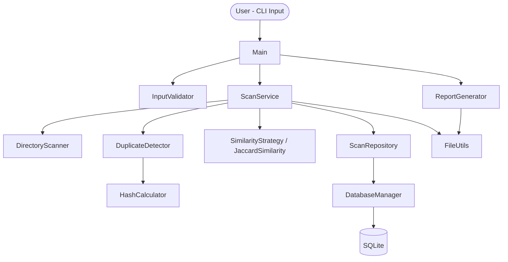
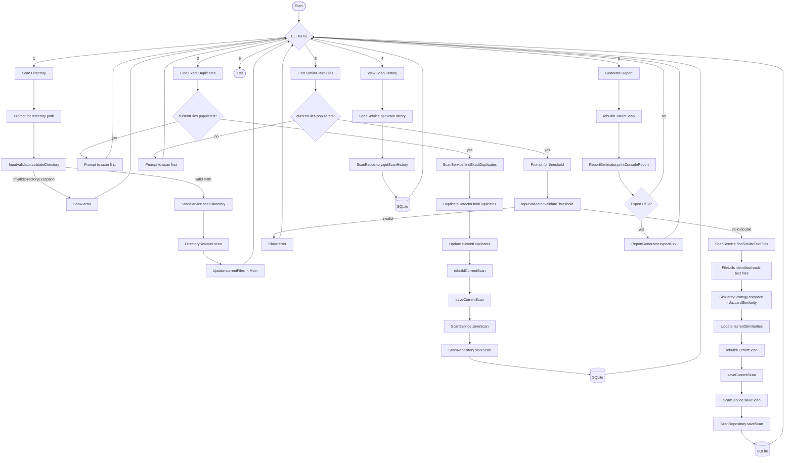
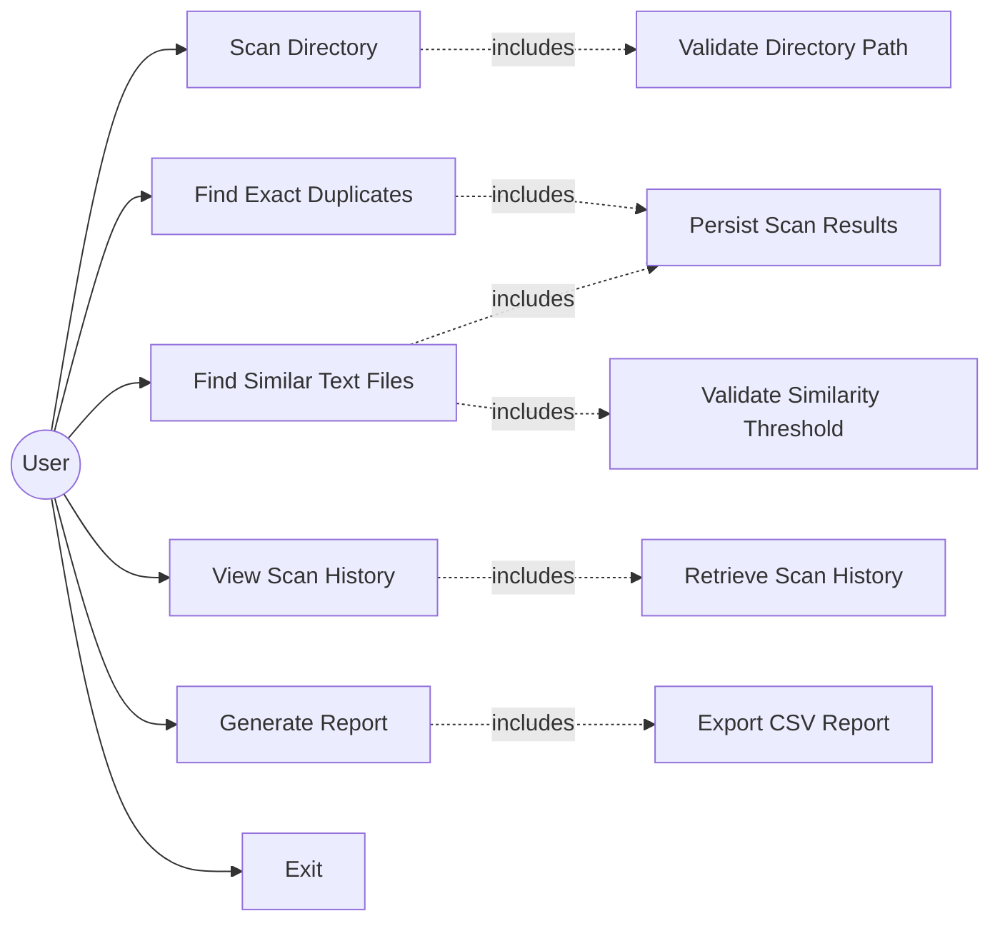
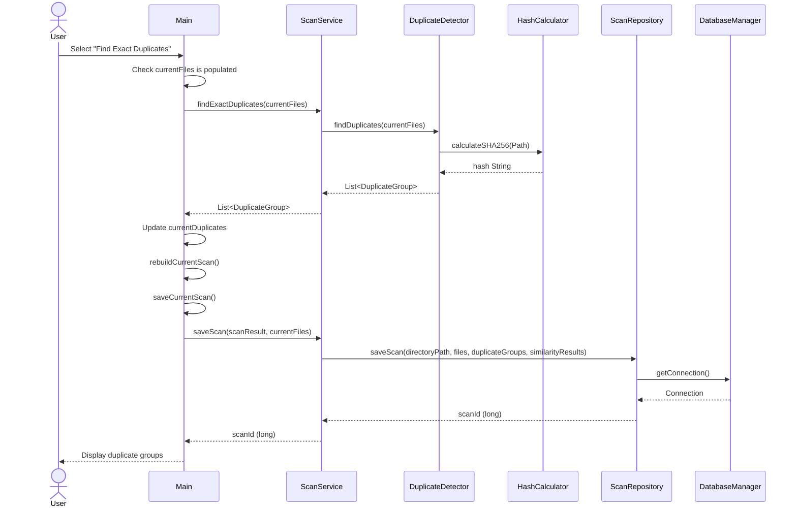
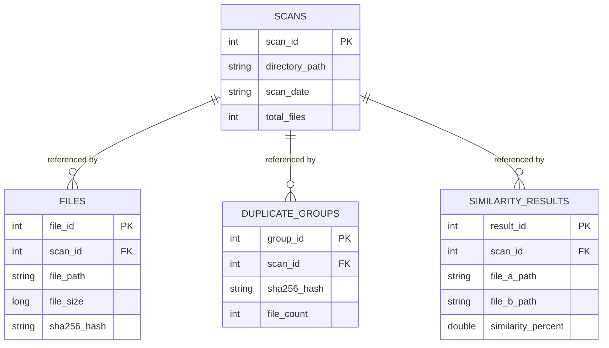

# Doppel — Design Diagrams

This document contains the design diagrams for the Doppel project: system architecture, workflow, use case, class diagram, sequence diagram, and ER diagram. All diagrams are written in Mermaid syntax and render automatically on GitHub. Class names, method signatures, and relationships reflect the actual Java source code.

## 1. System Architecture Diagram

Main directly coordinates `InputValidator`, `ScanService`, and `ReportGenerator`. `ScanService` is the only class that coordinates `DirectoryScanner`, `DuplicateDetector`, the similarity strategy, `ScanRepository`, and `FileUtils`; these are not called directly by `Main`.

## 2. Workflow / Process Flow Diagram

Scanning a directory (option 1) only populates `currentFiles`; it does not automatically run duplicate detection, similarity analysis, persistence, or reporting. Those actions occur only when the corresponding menu option is selected.

## 3. Use Case Diagram

Validation, persistence, history retrieval, and CSV export are internal supporting interactions triggered as part of a primary use case; the user does not invoke them directly.

## 4. Class Diagram

```mermaid
classDiagram
    class FileMetadata {
        -String filePath
        -long fileSize
        -long lastModified
        -String sha256Hash
        +getFilePath() String
        +getFileSize() long
        +getLastModified() long
        +getSha256Hash() String
        +setSha256Hash(String) void
        +toString() String
    }

    class ScanResult {
        -String scannedDirectory
        -int totalFilesScanned
        -List~DuplicateGroup~ duplicateGroups
        -List~SimilarityResult~ similarityResults
        +getScannedDirectory() String
        +getTotalFilesScanned() int
        +getDuplicateGroups() List~DuplicateGroup~
        +getSimilarityResults() List~SimilarityResult~
        +toString() String
    }

    class DuplicateGroup {
        -String sha256Hash
        -long fileSize
        -List~FileMetadata~ files
        +getSha256Hash() String
        +getFileSize() long
        +getFiles() List~FileMetadata~
        +getDuplicateCount() int
        +toString() String
    }

    class SimilarityResult {
        -String fileAPath
        -String fileBPath
        -double similarityPercentage
        +getFileAPath() String
        +getFileBPath() String
        +getSimilarityPercentage() double
        +toString() String
    }

    class DirectoryScanner {
        +scan(String directoryPath) List~FileMetadata~
    }

    class HashCalculator {
        +calculateSHA256(Path file) String
    }

    class DuplicateDetector {
        +findDuplicates(List~FileMetadata~) List~DuplicateGroup~
    }

    class SimilarityStrategy {
        <<interface>>
        +compare(String textA, String textB) double
    }

    class JaccardSimilarity {
        +compare(String textA, String textB) double
    }

    class DatabaseManager {
        -String DATABASE_URL
        -DatabaseManager instance
        -Connection connection
        +getInstance() DatabaseManager
        +getConnection() Connection
        +close() void
    }

    class ScanRepository {
        +saveScan(String directoryPath, List~FileMetadata~ files, List~DuplicateGroup~ duplicateGroups, List~SimilarityResult~ similarityResults) long
        +getScanHistory() List~String~
    }

    class ScanService {
        +scanDirectory(String directoryPath) List~FileMetadata~
        +findExactDuplicates(List~FileMetadata~) List~DuplicateGroup~
        +findSimilarTextFiles(List~FileMetadata~, double) List~SimilarityResult~
        +createScanResult(String directoryPath, List~FileMetadata~, List~DuplicateGroup~, List~SimilarityResult~) ScanResult
        +saveScan(ScanResult, List~FileMetadata~) long
        +getScanHistory() List~String~
    }

    class ReportGenerator {
        +printConsoleReport(ScanResult) void
        +exportCsv(ScanResult, String) void
    }

    class InputValidator {
        +validateDirectory(String directory) Path
        +validateThreshold(String input) double
    }

    class FileUtils {
        +isTextFile(String) boolean
        +readTextFile(String) String
        +escapeCsv(String) String
    }

    class InvalidDirectoryException {
        <<exception>>
    }

    class DatabaseOperationException {
        <<exception>>
    }

    SimilarityStrategy <|.. JaccardSimilarity
    DuplicateDetector --> HashCalculator
    DuplicateDetector ..> DuplicateGroup : produces
    DirectoryScanner ..> FileMetadata : produces
    DirectoryScanner ..> InvalidDirectoryException : throws
    ScanService --> DirectoryScanner
    ScanService --> DuplicateDetector
    ScanService --> SimilarityStrategy
    ScanService --> ScanRepository
    ScanService --> FileUtils
    ScanService ..> ScanResult : creates
    ScanRepository --> DatabaseManager
    ScanRepository ..> DatabaseOperationException : throws
    ScanResult --> DuplicateGroup
    ScanResult --> SimilarityResult
    DuplicateGroup --> FileMetadata
    ReportGenerator --> FileUtils
```

## 5. Sequence Diagram — Find Exact Duplicates (after a directory has already been scanned)

This diagram covers only the "Find Exact Duplicates" menu option. Report generation (`ReportGenerator`) is a separate flow triggered by menu option 5 and is not part of this sequence.

## 6. ER Diagram

Each `scans` row represents one scan operation (a directory scan, a duplicate-detection run, or a similarity-analysis run, since each of these can independently call `saveScan`). `files`, `duplicate_groups`, and `similarity_results` are child records that reference the specific scan operation that produced them; a single `scans` row does not necessarily represent every possible type of analysis for a directory.
